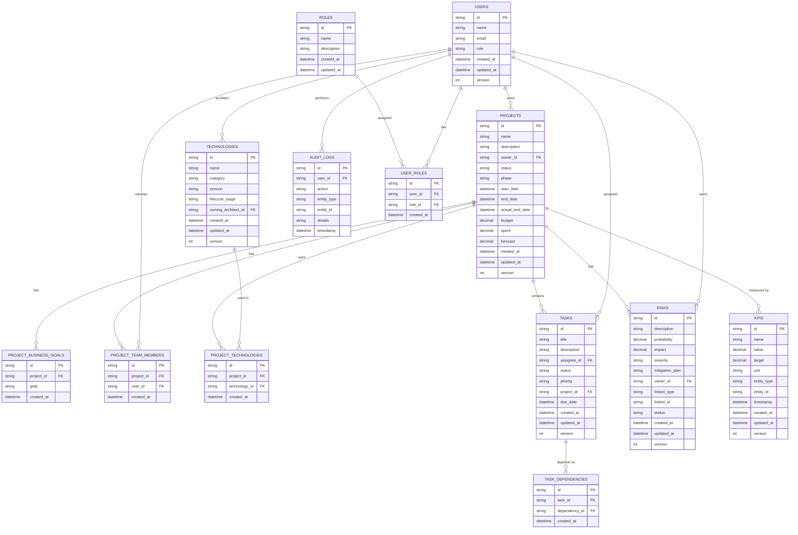

# Схема базы данных

## Общие принципы

База данных построена на PostgreSQL с использованием Prisma ORM. Все таблицы следуют принципам нормализации и включают необходимые индексы для оптимизации запросов. Каждая таблица имеет поля `created_at`, `updated_at` и `version` для отслеживания изменений.

## Диаграмма схемы базы данных



## Описание таблиц

### 1. Пользователи (users)

```sql
CREATE TABLE users (
    id UUID PRIMARY KEY DEFAULT gen_random_uuid(),
    name VARCHAR(255) NOT NULL,
    email VARCHAR(255) UNIQUE NOT NULL,
    role VARCHAR(50) NOT NULL CHECK (role IN ('admin', 'portfolio_manager', 'project_manager', 'viewer')),
    created_at TIMESTAMP WITH TIME ZONE DEFAULT CURRENT_TIMESTAMP,
    updated_at TIMESTAMP WITH TIME ZONE DEFAULT CURRENT_TIMESTAMP,
    version INTEGER DEFAULT 1
);
```

Индексы:

- `idx_users_email` - уникальный индекс по email
- `idx_users_role` - индекс по роли

### 2. Проекты (projects)

```sql
CREATE TABLE projects (
    id UUID PRIMARY KEY DEFAULT gen_random_uuid(),
    name VARCHAR(255) NOT NULL,
    description TEXT,
    owner_id UUID REFERENCES users(id),
    status VARCHAR(50) NOT NULL CHECK (status IN ('draft', 'active', 'on-hold', 'completed', 'cancelled')),
    phase VARCHAR(50) NOT NULL CHECK (phase IN ('planning', 'development', 'testing', 'release')),
    start_date TIMESTAMP WITH TIME ZONE,
    end_date TIMESTAMP WITH TIME ZONE,
    actual_end_date TIMESTAMP WITH TIME ZONE,
    budget DECIMAL(15,2) DEFAULT 0,
    spent DECIMAL(15,2) DEFAULT 0,
    forecast DECIMAL(15,2) DEFAULT 0,
    created_at TIMESTAMP WITH TIME ZONE DEFAULT CURRENT_TIMESTAMP,
    updated_at TIMESTAMP WITH TIME ZONE DEFAULT CURRENT_TIMESTAMP,
    version INTEGER DEFAULT 1
);
```

Индексы:

- `idx_projects_owner` - индекс по владельцу
- `idx_projects_status` - индекс по статусу
- `idx_projects_phase` - индекс по фазе
- `idx_projects_dates` - индекс по датам

### 3. Бизнес-цели проектов (project_business_goals)

```sql
CREATE TABLE project_business_goals (
    id UUID PRIMARY KEY DEFAULT gen_random_uuid(),
    project_id UUID REFERENCES projects(id) ON DELETE CASCADE,
    goal TEXT NOT NULL,
    created_at TIMESTAMP WITH TIME ZONE DEFAULT CURRENT_TIMESTAMP
);
```

Индексы:

- `idx_pbg_project_id` - индекс по project_id

### 4. Участники проекта (project_team_members)

```sql
CREATE TABLE project_team_members (
    id UUID PRIMARY KEY DEFAULT gen_random_uuid(),
    project_id UUID REFERENCES projects(id) ON DELETE CASCADE,
    user_id UUID REFERENCES users(id) ON DELETE CASCADE,
    created_at TIMESTAMP WITH TIME ZONE DEFAULT CURRENT_TIMESTAMP,
    UNIQUE(project_id, user_id)
);
```

Индексы:

- `idx_ptm_project_id` - индекс по project_id
- `idx_ptm_user_id` - индекс по user_id

### 5. Технологии (technologies)

```sql
CREATE TABLE technologies (
    id UUID PRIMARY KEY DEFAULT gen_random_uuid(),
    name VARCHAR(255) NOT NULL,
    category VARCHAR(100) NOT NULL,
    version VARCHAR(50) NOT NULL,
    lifecycle_stage VARCHAR(50) NOT NULL CHECK (lifecycle_stage IN ('selection', 'deployment', 'operation', 'deprecation', 'retired')),
    owning_architect_id UUID REFERENCES users(id),
    created_at TIMESTAMP WITH TIME ZONE DEFAULT CURRENT_TIMESTAMP,
    updated_at TIMESTAMP WITH TIME ZONE DEFAULT CURRENT_TIMESTAMP,
    version INTEGER DEFAULT 1
);
```

Индексы:

- `idx_tech_category` - индекс по категории
- `idx_tech_lifecycle` - индекс по стадии жизненного цикла
- `idx_tech_architect` - индекс по архитектору

### 6. Технологии проекта (project_technologies)

```sql
CREATE TABLE project_technologies (
    id UUID PRIMARY KEY DEFAULT gen_random_uuid(),
    project_id UUID REFERENCES projects(id) ON DELETE CASCADE,
    technology_id UUID REFERENCES technologies(id) ON DELETE CASCADE,
    created_at TIMESTAMP WITH TIME ZONE DEFAULT CURRENT_TIMESTAMP,
    UNIQUE(project_id, technology_id)
);
```

Индексы:

- `idx_pt_project_id` - индекс по project_id
- `idx_pt_technology_id` - индекс по technology_id

### 7. Задачи (tasks)

```sql
CREATE TABLE tasks (
    id UUID PRIMARY KEY DEFAULT gen_random_uuid(),
    title VARCHAR(255) NOT NULL,
    description TEXT,
    assignee_id UUID REFERENCES users(id),
    status VARCHAR(50) NOT NULL CHECK (status IN ('todo', 'in-progress', 'done', 'blocked')),
    priority VARCHAR(50) NOT NULL CHECK (priority IN ('low', 'medium', 'high', 'critical')),
    project_id UUID REFERENCES projects(id) ON DELETE CASCADE,
    due_date TIMESTAMP WITH TIME ZONE,
    created_at TIMESTAMP WITH TIME ZONE DEFAULT CURRENT_TIMESTAMP,
    updated_at TIMESTAMP WITH TIME ZONE DEFAULT CURRENT_TIMESTAMP,
    version INTEGER DEFAULT 1
);
```

Индексы:

- `idx_tasks_assignee` - индекс по исполнителю
- `idx_tasks_project` - индекс по проекту
- `idx_tasks_status` - индекс по статусу
- `idx_tasks_priority` - индекс по приоритету
- `idx_tasks_due_date` - индекс по дате выполнения

### 8. Зависимости задач (task_dependencies)

```sql
CREATE TABLE task_dependencies (
    id UUID PRIMARY KEY DEFAULT gen_random_uuid(),
    task_id UUID REFERENCES tasks(id) ON DELETE CASCADE,
    dependency_id UUID REFERENCES tasks(id) ON DELETE CASCADE,
    created_at TIMESTAMP WITH TIME ZONE DEFAULT CURRENT_TIMESTAMP,
    CHECK (task_id != dependency_id)
);
```

Индексы:

- `idx_td_task_id` - индекс по task_id
- `idx_td_dependency_id` - индекс по dependency_id

### 9. Риски (risks)

```sql
CREATE TABLE risks (
    id UUID PRIMARY KEY DEFAULT gen_random_uuid(),
    description TEXT NOT NULL,
    probability DECIMAL(3,2) NOT NULL CHECK (probability >= 0 AND probability <= 1),
    impact DECIMAL(3,2) NOT NULL CHECK (impact >= 0 AND impact <= 1),
    severity VARCHAR(50) NOT NULL CHECK (severity IN ('low', 'medium', 'high', 'critical')),
    mitigation_plan TEXT,
    owner_id UUID REFERENCES users(id),
    linked_type VARCHAR(50) NOT NULL,
    linked_id UUID NOT NULL,
    status VARCHAR(50) NOT NULL CHECK (status IN ('open', 'mitigated', 'closed')),
    created_at TIMESTAMP WITH TIME ZONE DEFAULT CURRENT_TIMESTAMP,
    updated_at TIMESTAMP WITH TIME ZONE DEFAULT CURRENT_TIMESTAMP,
    version INTEGER DEFAULT 1
);
```

Индексы:

- `idx_risks_owner` - индекс по владельцу
- `idx_risks_linked` - составной индекс по linked_type и linked_id
- `idx_risks_severity` - индекс по уровню серьезности
- `idx_risks_status` - индекс по статусу

### 10. KPI (kpis)

```sql
CREATE TABLE kpis (
    id UUID PRIMARY KEY DEFAULT gen_random_uuid(),
    name VARCHAR(255) NOT NULL,
    value DECIMAL(15,2) NOT NULL,
    target DECIMAL(15,2) NOT NULL,
    unit VARCHAR(50) NOT NULL,
    entity_type VARCHAR(50) NOT NULL,
    entity_id UUID NOT NULL,
    timestamp TIMESTAMP WITH TIME ZONE NOT NULL,
    created_at TIMESTAMP WITH TIME ZONE DEFAULT CURRENT_TIMESTAMP,
    updated_at TIMESTAMP WITH TIME ZONE DEFAULT CURRENT_TIMESTAMP,
    version INTEGER DEFAULT 1
);
```

Индексы:

- `idx_kpis_entity` - составной индекс по entity_type и entity_id
- `idx_kpis_timestamp` - индекс по времени

### 11. Аудит лог (audit_logs)

```sql
CREATE TABLE audit_logs (
    id UUID PRIMARY KEY DEFAULT gen_random_uuid(),
    user_id UUID REFERENCES users(id),
    action VARCHAR(100) NOT NULL,
    entity_type VARCHAR(100) NOT NULL,
    entity_id UUID NOT NULL,
    details JSONB,
    timestamp TIMESTAMP WITH TIME ZONE DEFAULT CURRENT_TIMESTAMP
);
```

Индексы:

- `idx_audit_user` - индекс по пользователю
- `idx_audit_entity` - составной индекс по entity_type и entity_id
- `idx_audit_timestamp` - индекс по времени

### 12. Роли (roles)

```sql
CREATE TABLE roles (
    id UUID PRIMARY KEY DEFAULT gen_random_uuid(),
    name VARCHAR(100) UNIQUE NOT NULL,
    description TEXT,
    created_at TIMESTAMP WITH TIME ZONE DEFAULT CURRENT_TIMESTAMP,
    updated_at TIMESTAMP WITH TIME ZONE DEFAULT CURRENT_TIMESTAMP
);
```

Индексы:

- `idx_roles_name` - уникальный индекс по имени

### 13. Роли пользователей (user_roles)

```sql
CREATE TABLE user_roles (
    id UUID PRIMARY KEY DEFAULT gen_random_uuid(),
    user_id UUID REFERENCES users(id) ON DELETE CASCADE,
    role_id UUID REFERENCES roles(id) ON DELETE CASCADE,
    created_at TIMESTAMP WITH TIME ZONE DEFAULT CURRENT_TIMESTAMP,
    UNIQUE(user_id, role_id)
);
```

Индексы:

- `idx_ur_user_id` - индекс по user_id
- `idx_ur_role_id` - индекс по role_id

## Триггеры и ограничения

### Обновление времени изменения

Для всех таблиц с полем `updated_at` создается триггер, автоматически обновляющий это поле при изменении записи.

### Проверка целостности данных

- Все внешние ключи имеют ограничения ON DELETE CASCADE или SET NULL
- Проверки значений через CHECK constraints
- Уникальные ограничения для предотвращения дубликатов

### Индексы для оптимизации

- Составные индексы для часто используемых запросов
- Частичные индексы для фильтрации по статусам
- GiST индексы для полнотекстового поиска (если требуется)

## Миграции

Все изменения схемы базы данных осуществляются через миграции Prisma, которые обеспечивают:

- Версионирование схемы
- Откат изменений
- Автоматическую генерацию SQL скриптов
- Проверку совместимости изменений
